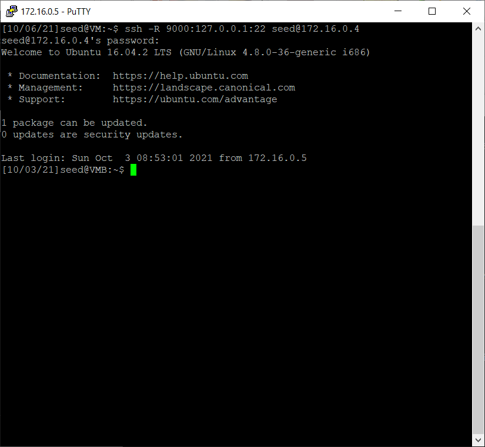

# Introduction

This project provides the insights on how firewalls work from seedlab.
Ubuntu 16.04 LTS is the target operating system for this project. The
lab includes four task which will be covered in this report. A
conclusion including the summary of this project and some learning
experiences also introduced.

# Environments

- The project includes a VM setup for the UNIX environment, Ubuntu 16.04
LTS desktop version installation media can be downloaded at
<https://releases.ubuntu.com/16.04/> 
- Vmware VM workstation is used as a
virtual platform.

The setup of the VMs is shown as follows.

Machine A

Machine B

The network configuration will be as follows

|                                       | Machine A     | Machine B     |
|---------------------------------------|---------------|---------------|
| VM Network adapter Network connection | NAT           | NAT           |
| VM Network subnet                     | 172.16.0.0/24 | 172.16.0.0/24 |
| Network adapter in OS                 | ens33         | ens33         |
| Assigned IP by DHCP                   | no            | no            |
| IP Address                            | 172.16.0.5    | 172.16.0.4    |
| Subnet mask                           | 255.255.255.0 | 255.255.255.0 |
| Default Gateway                       | 172.16.0.254  | 172.16.0.254  |

# Project Task

## Task 1: Using Firewall

This is the task the linux firewall-iptables operation is required. The
following is the screenshot for the bash shell operation

### Preparation

The ensure the firewall iptables is in install and in active, the
following command is used to ensure the iptables is installed and
operate without any policy.

Use the following commnad to check the application is installed and
is in active status.
> sudo service ufw status 

Then run the following command to flush the iptables policy table and
list the policy to ensure the policy table is empty

> $sudo iptables -F

> $sudo iptables -L
</th>

### Lab Task

#### To Prevent A from doing telnet to Machine B

##### Implementation

The following command is used to implement the firewall for the task
objective

> sudo iptables -A OUTPUT -p tcp --dport 23 -d 172.16.0.4 -j DROP

##### Verification

The verification is start the telnet from machine A to Machine B, the
following command is used

> telnet 172.16.0.4

The command result a connection timeout since the tcp packet from
machine A to machine B is dropped by the iptables firewall at machine A

#### Prevent B from doing telnet to Machine A.

##### Implementation

The following command is used to implement the firewall for the task
objective

> sudo iptables -A INPUT -p tcp --dport 23 -s 172.16.0.4 -j REJECT

#### Prevent A from visiting an external web site. 

##### Implementation

The following command is used to implement the firewall for the task
objective, we use [www.nyit.edu](http://www.nyit.edu) as target website
for testing

> sudo iptables -A OUTPUT -d www.nyit.edu -j REJECT 

## Task 2: Implementing a Simple Firewall

### Preparation

In this task, implementation of simple firewall with packeting filtering
features. In this task, some programming and kernel module installation
is required. Before the implementation, to remove the iptables policy is
required in order to eliminate the effect from iptables. The following
is the command to do so.

### Implemetation

The following is the sourcecode and the procedure to compile, install
and verification. The simple firewall contains 5 rules.

#### Firewall Policy design

The following is the policy in high level, the policy design default
allow, when only filtered the listed items.

| Policy \# | Direction | Protocol | Src IP     | Src Port | Dest IP       | Dest Port | Description                                                                              |
|-----------|-----------|----------|------------|----------|---------------|-----------|------------------------------------------------------------------------------------------|
| 1         | Outbound  | TCP      | ANY        | ANY      | 172.16.0.4    | 23        | Prohibit the telnet traffic from Machine A to Machine B                                  |
| 2         | Inbound   | TCP      | 172.16.0.4 | ANY      | 172.16.0.5    | 23        | Prohibit the telnet traffic from Machine B to Machine A                                  |
| 3         | Outbound  | TCP      | ANY        | ANY      | 61.35.176.173 | 80        | Prohibit the HTTP traffic from Machine A to [www.nyit.edu](http://www.nyit.edu) website  |
| 4         | Outbound  | TCP      | ANY        | ANY      | 61.35.176.173 | 443       | Prohibit the HTTPS traffic from Machine A to [www.nyit.edu](http://www.nyit.edu) website |
| 5         | Outbound  | UDP      | ANY        | ANY      | 172.16.0.4    | ANY       | Prohibit the UDP traffic from Machine A to Machine B                                     |

#### Sourcecode listing

The following is the sourcecode of the simple firewall(locate at simplefirewall folder ), there are 3
files for the whole application setup, the following is the list and its
content.

| \#  | File Name        | Description                                                                                                                                             |
|-----|------------------|---------------------------------------------------------------------------------------------------------------------------------------------------------|
| 1   | Makefile         | The make configuration file for the kernel module build, additional mode ‘debug’ is added in order to generate more log for debugging                   |
| 2   | simplefirewall.h | The C header file for the simple firewall application, which include the required header file and structure for the policy table                        |
| 3   | simplefirewall.c | The C source code which contains the application logic and the the system calls for the packet filtering operation. The policy table build is included. |

#### Command for kernel module nuild and implementation

Command to Build the application
> make all

Debug build
> make debug

To Install the kernel module, the insmod command can do the work and the
lsmod command can list the installed kernel module

To install the module
> sudo insmod simplefirewall.ko
To verify the module is installed
> sudo lsmod | grep simple

To remove the kernel module, use the rmmod command
> sudo rmmod simplefirewall.ko

#### troubleshoot the kernel module

To troubleshoot the kernel module, this printk function in the
application will print out the message to the kernel log. Use dmesg will
able to capture the log message. The switch -wH will keep the console
continuing to capture the kernel log.

> dmesg -wH

## Task 3: Evading Egress Filtering

### Preparation

In this task, evading egress filtering by tunneling is the primary
objectives. In this task, some knowledge of SSH tunneling and iptables
is required. Before the implementation, to prepare the iptables policy
is required in order to ensure the proper firwall . The following is the
command to do so.

#### Remove the simplefirewall module

#### Ensure iptables is active and no pervious rules

#### Block all the outgoing traffic to external telnet servers
At Machine A
> sudo iptables -A OUTPUT -p tcp --dport 23 -j REJECT

#### Block all the outgoing traffic to www.facebook.com

#### Vertification of telnet traffic is blocked

#### Vertification of outgoing traffic to www.facebook.com is blocked

Vertification of outgoing traffic to www.facebook.com is blocked

### Implemetation

To implement the tunnel, we need to do the following to setup the tunnel
in between machine A and machine B. the following is the command to do
so.

#### Task 3a – the SSH tunnel for telnet service

#### Task 3b – the SSH tunnel for facebook website

Configuration for proxy at machine A

## Task 4: Evading Ingress Filtering

### Preparation

In this task, evading ingress filtering by reserve tunneling is the
primary objectives. In this task, some knowledge of SSH tunneling and
iptables is required. Before the implementation, to prepare the iptables
policy is required in order to ensure the proper firwall . The following
is the command to do so.

#### Remove the simplefirewall module

#### Ensure iptables is active and no pervious rules

#### Block Machine B from accessing its port 80 (web server) and 22 (SSH server)

### Implemetation

To implement the reserve tunnel, we need to do the following to setup
the tunnel in between machine A and machine B. the following is the
command to do so.

#### For reserve tunnel for SSH service from machine B to machine A

#### Reserve tunnel setup for HTTP service from machine B to machine A

### Verification

- Task 4a - SSH test

Screenshot verification for tunnel is active(Machine B)

- Task 4b – visiting HTTP service at machine A

wget screenshot

Firefox screenshot

Screenshot verification for tunnel is active

# Reference

1.  Du, W. (n.d.). *Linux firewall exploration lab*. SEED Project.
    <https://seedsecuritylabs.org/Labs_16.04/Networking/Firewall/>

2.  The kernel development community. (n.d.). *Networking — The Linux
    kernel documentation*.
    <https://linux-kernel-labs.github.io/refs/heads/master/labs/networking.html>
